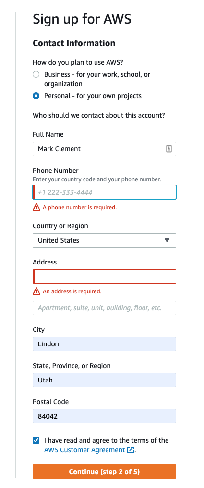

# Setting Up Your AWS account
Amazon Web Services (AWS) provides access to cloud based web servers through their [Cloud9](https://aws.amazon.com/cloud9/) service.  
In this learning activity, you will set up your Amazon AWS account.

1. In your browser, select the [AWS login page](https://portal.aws.amazon.com/gp/aws/developer/registration/) and select “Create a new AWS account”.  
     
2. Fill in your address information  
  
3. On the next screen, you will enter a credit card.  There should not be charges for normal usage for the class.  If you have signed up before, there may be a charge for around $3.50 per month.  Since we dont have a book for this class, consider this to be the cost of the book you would have purchased.  
  
4. Congratulations!  You have now set up your account and can access an incredible number of cloud services.  Once you understand how to use an Amazon cloud server, you will be able to use other cloud providers (like Google) if you want to investigate them in the future.  
  
5. You should get an email from amazon with links to training materials and information on how to get started.  Make sure the email doesn't end up in your SPAM folder.  You will want to be able to receive emails from Amazon in the future.  

[Next Tutorial](cloud9.md)
