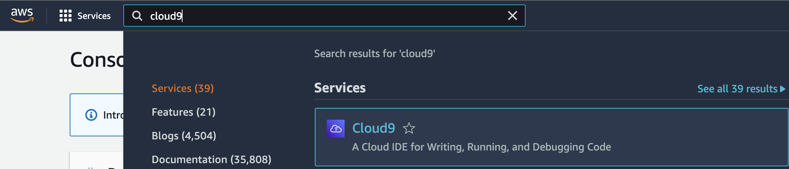
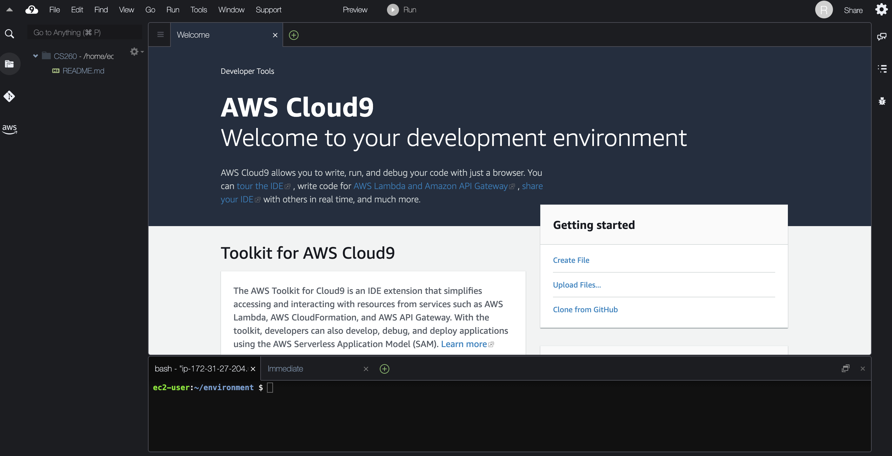

6. Now you want to create a web server with Cloud9 so that your Mom can see your amazing web pages. [Sign into the AWS console](https://signin.aws.amazon.com/) as the Root User.  
  
7. Then search for "Cloud9" in the upper left search bar.  
  
8. Create a Cloud9 environment

9. Give your environment a name (pick whatever you want, but make it meaningful).

10. Configure the Cost-saving settings so that the web server will never hibernate.

11. Then create the environment.  It can take several minutes to set up your server.  The system is allocating a virtual server on a real computer somewhere in the Amazon Web Services infrastructure.  You should select the "US West (N. California)" region for your server in the upper right corner of the screen.

12. You should now be able to see your Cloud9 window.  On the left pane is your directory or folder browser, in the center is your editor and on the bottom you will see a command line interface that will allow you to type commands for your server.

13. Congratulations! You now have your own website configured.  All you have to do is upload html pages to this S3 bucket and they will be served at the URL shown for your S3 bucket.  You can see the URL for the bucket at the bottom of the "Static website hosting" pane.  You can put this into the URL bar of your web browser and you will be able to see the web pages you have uploaded.  
  
14. Now go back to your S3 bucket name and upload the index.html file you created and displayed in your Docker web server.  You should be able to see this page at the URL shown in your "Static website hosting" pane.  
16. You may want to look through the [Cloud9 tutorial](https://docs.aws.amazon.com/cloud9/latest/user-guide/tutorial.html) to become more familiar with how Cloud9 works.
