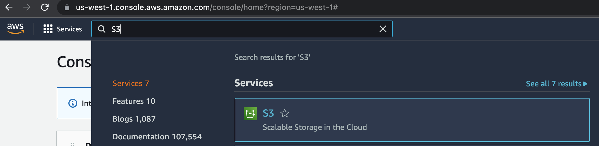

# AWS Setup
Now that you can see the files that your docker web server is serving in your web browser, you want other people throughout the world (like your Mom) to be able to see them too.  In order to do this, we will be using a cloud based web server to serve your files.  

Amazon Web Services (AWS) provides a cloud based web server through their [S3 buckets](https://docs.aws.amazon.com/AmazonS3/latest/userguide/Welcome.html).  
In this learning activity, you will set up your Amazon AWS account and then will create a S3 bucket to serve your web pages.  We will show you how to manage your own web server later in the class.
1. In your browser, select the [AWS login page](https://portal.aws.amazon.com/gp/aws/developer/registration/) and select “Create a new AWS account”.  
  
2. Fill in your address information  
  
3. On the next screen, you will enter a credit card.  There should not be charges for normal usage for the class.  If you have signed up before, there may be a charge for around $3.50 per month.  Since we dont have a book for this class, consider this to be the cost of the book you would have purchased.  
  
4. Congratulations!  You have now set up your account and can access an incredible number of cloud services.  Once you understand how to use an Amazon cloud server, you will be able to use other cloud providers (like Google) if you want to investigate them in the future.  
  
5. You should get an email from amazon with links to training materials and information on how to get started.  Make sure the email doesn't end up in your SPAM folder.  You will want to be able to receive emails from Amazon in the future.  
  
6. Now you want to create a web server on the Cloud so that your Mom can see your amazing web pages.  We are going to create an S3 Bucket.  The S3 stands for Simple Storage Service.  [Sign into the console](https://signin.aws.amazon.com/signin?redirect_uri=https%3A%2F%2Fconsole.aws.amazon.com%2Fconsole%2Fhome%3FhashArgs%3D%2523%26isauthcode%3Dtrue%26state%3DhashArgsFromTB_us-west-1_5b2d0ef13cbb52f1&client_id=arn%3Aaws%3Asignin%3A%3A%3Aconsole%2Fcanvas&forceMobileApp=0&code_challenge=4rWw-_0XowrTkXk43FL4hscMfUB_on_GmhcctmH2gH4&code_challenge_method=SHA-256) as the Root User.  
  
7. Then search for "S3" in the upper left search bar.  
  
8. Once you are in the S3 Console, select "Create Bucket".  
  
9. You will give it a name and unselect the button to block public access.  S3 buckets provide the ability to control exactly who can see your content.  You want to allow anyone to see your web pages. Select the "Create Bucket" button.  
  
10. Select your bucket by name and go to the "properties" tab and scroll to the bottom.   
  
11. Select edit on the "Static website hosting" pane and type in "index.html" as the default page to display from your bucket.
  
11. Now you can add a bucket policy to grant public read access to your bucket. When you grant public read access, anyone on the internet can access your bucket.  Edit the "Bucket Policy" in the "permissions" tab to have the following content. Replace YOURBUCKETNAME with the name of your bucket.  
```
{
    "Version": "2012-10-17",
    "Statement": [
        {
            "Sid": "PublicReadGetObject",
            "Effect": "Allow",
            "Principal": "*",
            "Action": "s3:GetObject",
            "Resource": "arn:aws:s3:::YOURBUCKETNAME/*"
        }
    ]
}
```
13. Congratulations! You now have your own website configured.  All you have to do is upload html pages to this S3 bucket and they will be served at the URL shown for your S3 bucket.  You can see the URL for the bucket at the bottom of the "Static website hosting" pane.  You can put this into the URL bar of your web browser and you will be able to see the web pages you have uploaded.  
  
14. Now go back to your S3 bucket name and upload the index.html file you created and displayed in your Docker web server.  You should be able to see this page at the URL shown in your "Static website hosting" pane.  
16. If you have trouble or want to know more about S3 bucket hosting, this [tutorial](https://docs.aws.amazon.com/AmazonS3/latest/userguide/HostingWebsiteOnS3Setup.html) should go through the same steps in a different way.  
