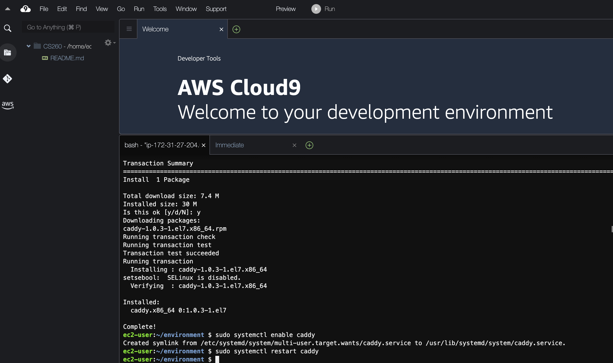
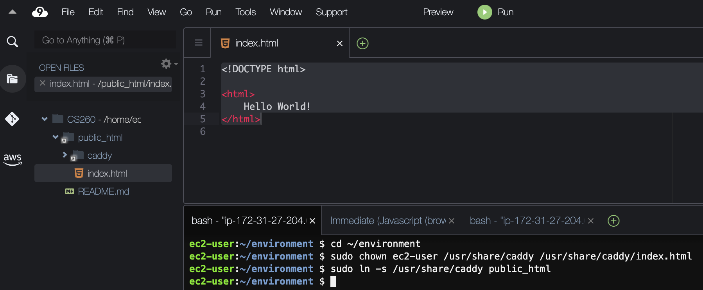
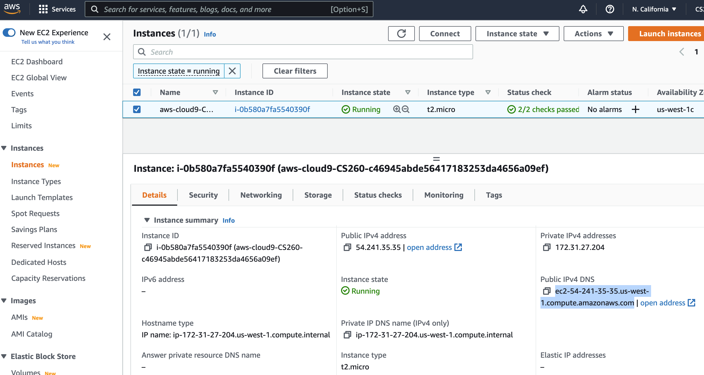
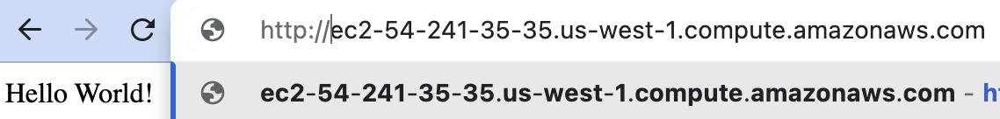

# Setting up Caddy
In this tutorial we will set up [Caddy](https://caddyserver.com/), a web server that will answer requests from web browsers.  
We will provide you with minimal instructions on how to use these systems so you aren't confused, but 
you are welcome to explore more of the features on your own if you have time.
One of the great features of Caddy is that it will automatically serve your websites over HTTPS. 
Other web servers -- Apache, nginx -- can do this too, but they require separate steps and more configuration. 
Caddy was written by a BYU student, Matt Holt, who still leads the project.

0. If you don't have Cloud9 running, then navigate to Cloud9 on AWS and click "Start IDE". Inside the IDE, you will see a bash terminal at the bottom:
  
1. First install Caddy from the command line in your Cloud9 console and use systemctl to cause it to run even if your Cloud9 instance reboots.  We use the "sudo" command to indicate that this command should be run as superuser.  Normal users can't modify the system configuration, but your user has the ability to become a superuser.  But don't get too excited, your superpowers do not include leaping over tall buildings in a single bound.  You are running a version of the Ubuntu Linux operating system and ["apt"](https://ubuntu.com/server/docs/package-management) is a package manager that you can use to install software on your Cloud9 instance.  Enter the following commands in your command line window (near the bottom of your browser window).
```
sudo apt install -y debian-keyring debian-archive-keyring apt-transport-https
sudo curl -1sLf 'https://dl.cloudsmith.io/public/caddy/stable/gpg.key' | sudo gpg --dearmor -o /usr/share/keyrings/caddy-stable-archive-keyring.gpg
sudo curl -1sLf 'https://dl.cloudsmith.io/public/caddy/stable/debian.deb.txt' | sudo tee /etc/apt/sources.list.d/caddy-stable.list
sudo apt update
sudo apt install caddy
```
Your Ubuntu machine has apache installed as the default web browser.  You will need to stop it and start caddy.
```
sudo systemctl stop apache2
sudo systemctl disable apache2
sudo systemctl enable caddy
sudo systemctl restart caddy
```


2. By default, Caddy will serve files from the directory "/usr/share/caddy".  You can create a symbolic link to that directory with the following commands.  The "cd" command takes you to your environment directory.  This is the directory you see in the file tree in the upper left corner of your Cloud9 console.  The "chown" command will change the owner of the "/usr/share/caddy" directory to your ec2-user so you can write files to that directory.  The "ln -s" command creates a symbolic link from the public_html directory in your environment to the directory that caddy will serve. 
```
cd ~/environment
sudo chown ubuntu /usr/share/caddy /usr/share/caddy/index.html 
sudo ln -s /usr/share/caddy public_html
```
3. You should be able to see the public_html folder in your file tree.  Open the "index.html" file in your edit window and replace the contents of the file with the following:
```
<!DOCTYPE html>

<html>
    Hello World!
</html>
```

7. Congratulations! You now have your own website configured.  
All you have to do is edit html pages to your public_html directory and they will be served at the URL shown for your EC2 node.  
You can see the URL for your EC2 node by going back to the AWS console, searching for EC2 and selecting your instance.  You will see the "Public IPv4 DNS" entry for your Cloud9 instance.  
 
8. Now paste this domain address into your web browser and change it from https to http.  You should be able to see your index.html file rendered in your browser.



9. You may want to look through the [Cloud9 tutorial](https://docs.aws.amazon.com/cloud9/latest/user-guide/tutorial.html) 
to become more familiar with how Cloud9 works and how to use the dashboard.

10. If you have trouble with Caddy, you can use the following commands to get status and reload the configuration file
```
systemctl status caddy
sudo systemctl reload caddy
```

[Next Tutorial](https.md)
