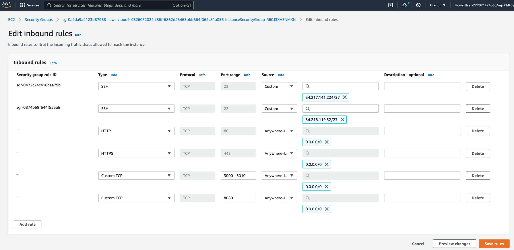

Now that you have your Cloud9 instance running, you need to configure it as a web server.  
You have access to a full Linux machine and you can install and run software on this server.
We will be teaching you some basic systems administration commands and will be building just
enough command line tools to allow you to be successful. 

First you will open port 80 in the firewall to allow web browsers to connect to your server.  A firewall keeps anyone from connecting to your machine on ports that you havent secured.  This protects your machine from hackers.

1. Sign into the [AWS console](https://aws.amazon.com/console/) and search for the EC2 service.  Amazon Elastic Compute Cloud (Amazon EC2) is a the service that your Cloud9 web server is running on, so you will need to configure the firewall in the EC2 dashboard.

2. You should see one instance running.  This is your Cloud9 virtual server.

4. Select the first security group and notice that the inbound rules allow port 22 to connect to your instance.  This is the port that Secure Shell connects to from your Cloud9 console.  You want to add port 80 (for HTTP) and port 442 (for HTTPS) to the inbound rules.

5. Edit Inbound rules and add a rule for port 80 (HTTP) and 443 (HTTPS) with Source 0.0.0.0/0 which specifies that the server should accept connections on these ports from anywhere.  Select the "Save rules" button and congratulate yourself for setting up the firewall.

