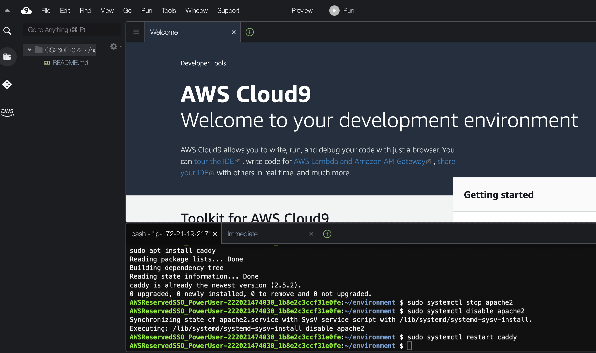

# Setting up Caddy
In this tutorial we will set up [Caddy](https://caddyserver.com/), a web server that will answer requests from web browsers.  
We will provide you with minimal instructions on how to use these systems so you aren't confused, but 
you are welcome to explore more of the features on your own if you have time.

1. Start Cloud9.

If you don't have Cloud9 running, then navigate to Cloud9 on AWS and click "Start IDE". Inside the IDE, you will see a bash terminal at the bottom:


2. Using the bash terminal, install Caddy.

We use the "sudo" command to indicate that this command should be run as superuser.  Normal users can't modify the system configuration, but your user has the ability to become a superuser.  But don't get too excited, your superpowers do not include leaping over tall buildings in a single bound.  You are running a version of the Ubuntu Linux operating system and ["apt"](https://ubuntu.com/server/docs/package-management) is a package manager that you can use to install software on your Cloud9 instance.  Enter the following commands in your command line window (near the bottom of your browser window).
```
sudo apt install -y debian-keyring debian-archive-keyring apt-transport-https
sudo curl -1sLf 'https://dl.cloudsmith.io/public/caddy/stable/gpg.key' | sudo gpg --dearmor -o /usr/share/keyrings/caddy-stable-archive-keyring.gpg
sudo curl -1sLf 'https://dl.cloudsmith.io/public/caddy/stable/debian.deb.txt' | sudo tee /etc/apt/sources.list.d/caddy-stable.list
sudo apt update
sudo apt install caddy
```

3. Setup caddy to run.

We will use systemctl to tell Ubuntu it to run caddy if your Cloud9 instance reboots.  Your Ubuntu machine has apache installed as the default web browser.  These commands will stop apache, disable it from running, enable caddy to be run when your instance reboots, and then start caddy.
```
sudo systemctl stop apache2
sudo systemctl disable apache2
sudo systemctl enable caddy
sudo systemctl restart caddy
```


4. Configure caddy.

Go back to the EC2 dashboard in AWS Management console. Then select "Instances" and click on your Instance.

Next, find the host name for your EC2 instance -- it is labeled "Public IPv4 DNS".

 

For example, my host name is `ec2-54-186-104-251.us-west-2.compute.amazonaws.com`.

Once you know this host name, you can edit `/etc/caddy/Caddyfile` so that it uses this host name.

Edit the file using the nano editor by running the following command from the command line.

```
sudo vim /etc/caddy/Caddyfile
```

You need to replace the ":80" with the host name for your web server.

To navigate in the vim editor, use the arrow keys. Once you get to the line where you want to edit the file, type `i`. This changes to `insert mode`.
You can now paste in the host name so that the configuration looks like this:

```

ec2-54-186-104-251.us-west-2.compute.amazonaws.com {
        # Set this path to your site's directory.
        root * /usr/share/caddy
```

Once you have done this, then type the `ESC` or escape key, and you are out of insert mode. Then you can type `:wq` to write the file and quit vim.


5. Restart caddy to make caddy use the new configuration file.

```
sudo systemctl restart caddy
```

6. Now you can visit your web server using the `open address` link shown in your EC2 instance, right next to where you found the host name. You should see this:


[Next Tutorial](directories.md)
