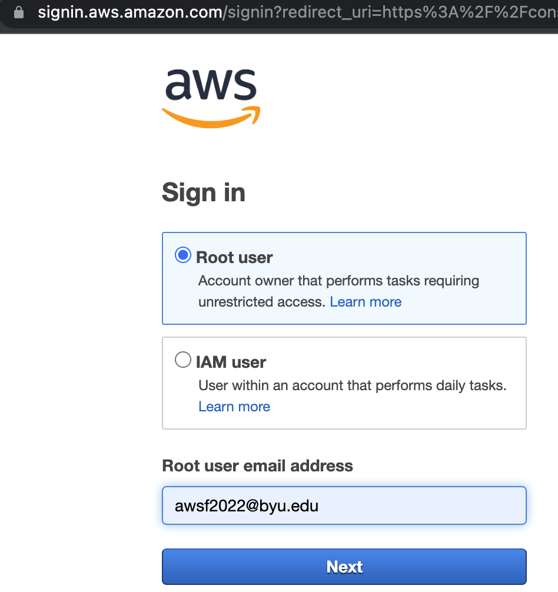
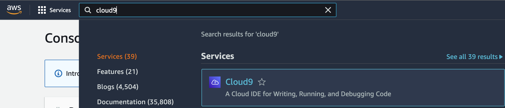
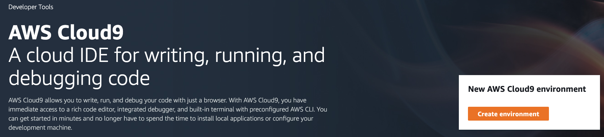
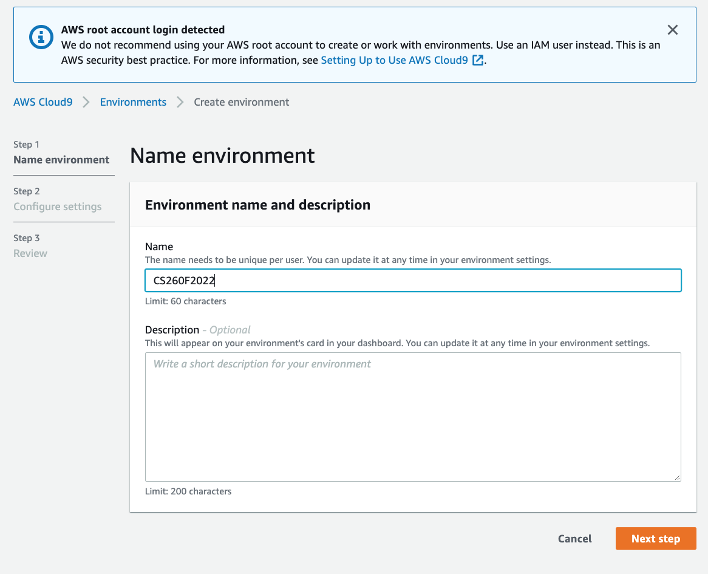
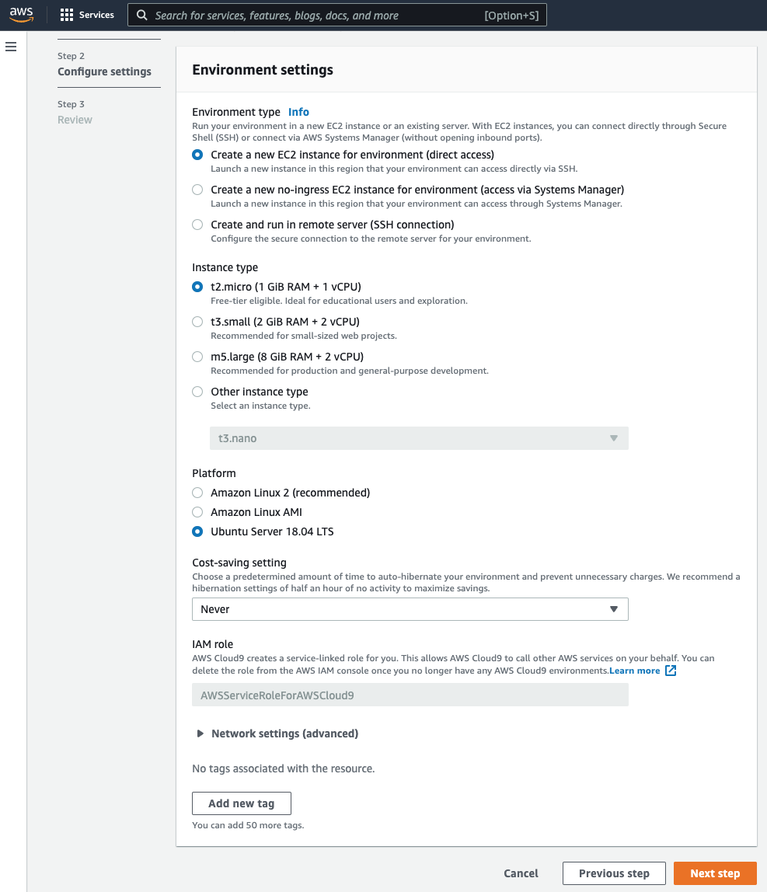
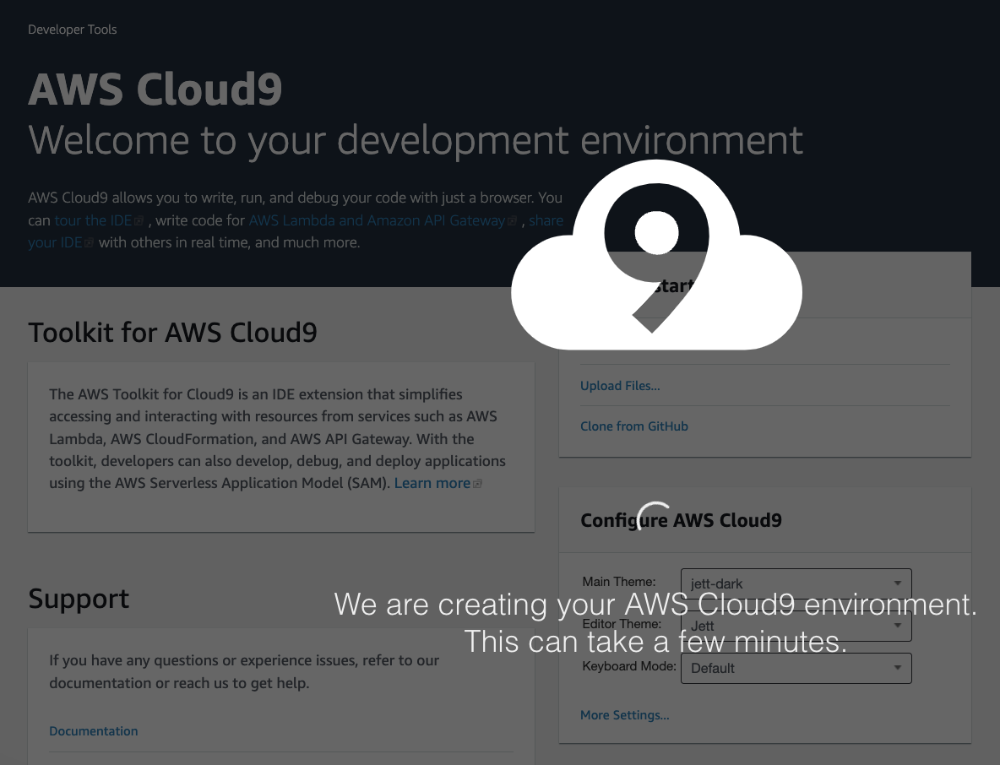
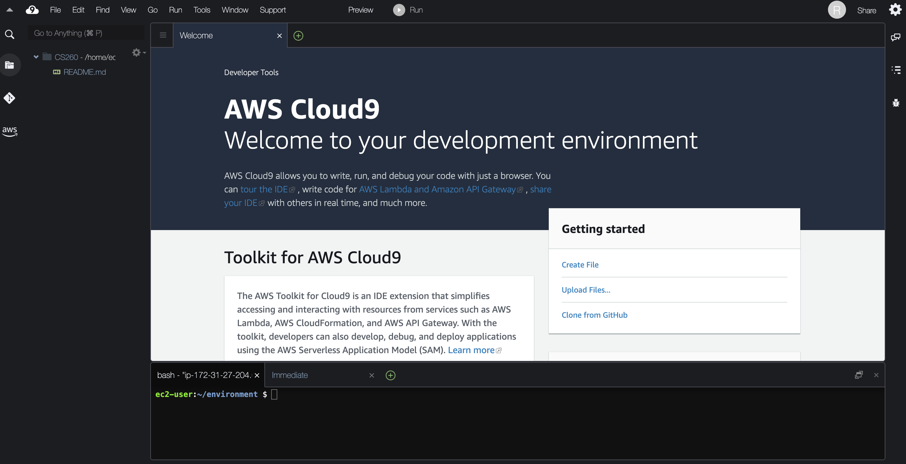

# Setting Up Cloud9
Now you want to create a web server with Cloud9 so that your Mom can see your amazing web pages. In this tutorial, we will show you how to create a Cloud9 instance, in the next one we will show you how to configure your Cloud9 instance as a web sever.
1. [Sign into the AWS console](https://signin.aws.amazon.com/) as the Root User.  
  
7. Then search for "Cloud9" in the upper left search bar.  
  
8. Create a Cloud9 environment

9. Give your environment a name (pick whatever you want, but make it meaningful).

10. Configure the Cost-saving settings so that the web server will never hibernate and select "Ubuntu Server" for the platform.

11. Then create the environment.  It can take several minutes to set up your server.  The system is allocating a virtual server on a real computer somewhere in the Amazon Web Services infrastructure.  You should select the "US West (N. California)" region for your server in the upper right corner of the screen.

12. You should now be able to see your Cloud9 window.  On the left pane is your directory or folder browser, in the center is your editor and on the bottom you will see a command line interface that will allow you to type commands for your server.

13. We will be using the command line to configure your Cloud9 instance as a web server.  But this will be covered in a later tutorial.

[Next Tutorial](firewall.md)
