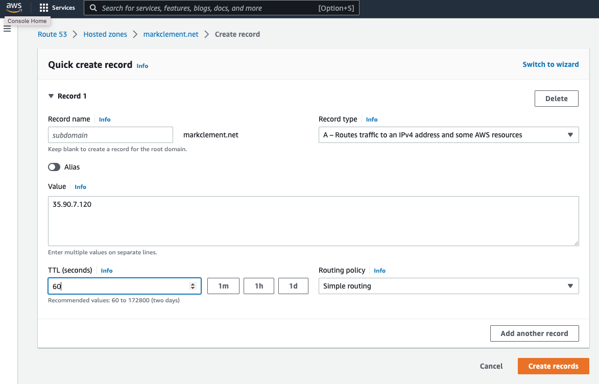

# Setting up Your own Domain 

In this tutorial, we will show you how to create your own domain name to point to your EC2 instance
1. Go back to the services icon in the AWS Management console. Then select "Route53".  This service will allow you to create your own domain.

 


2. Enter the domain you would like to buy in the "Register Domain" form and hit "Check".  
The system will then look to see if that domain is available and will provide you with alternatives if that domain is not available.

 

3. Select "Add to Cart" for the domain you would like to buy and press "Continue".

 

4. Fill out your contact information and press "Continue".

 

5. Agree to the terms and press "Complete Order".  This will charge your credit card, but the charge will only occur once per year.  
If you dont want a reoccuring charge, you can select the box before submitting.

 

6. Withing 24 hours, you should get email indicating that your domain has been created.  Make sure the email doesnt go into your spam folder.  
Verify your email address by selecting the link.  
```
If your email address needs to be verified, one of our registrar associates will send an email to the registrant contact when domain registration is approved, as required by ICANN. The email will come either from noreply@domainnameverification.net or noreply@registrar.amazon.com
```

7. You should get another email showing you how to configure your domain.
```
Dear AWS customer,

We successfully registered the markclement.net domain. We also created a hosted zone for the domain.

Your next step is to add records to the hosted zone. These records contain information about how to route traffic for your domain and any subdomains. To learn how to add records to your hosted zone, see Working with Records.
```

Go back to your Route53 dashboard and select "Hosted zones"
 

8. Select your domain and press "Create Record"

 

9. In another tab, go to your EC2 Dashboard and copy the public IPV4 Address


10. Paste your public IPV4 address into the A record. 
I recommend a TTL (Time To Live) of 60 seconds so you can make changes and have them appear quickly.
Then select "Create Records".  You should see the A record with your IP address in the list.



11. You should now be able to use your domain in your Caddy configuration file and Caddy will generate a certificate for you.
