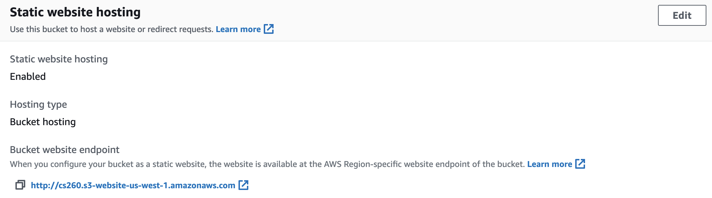

6. Now 
7. Congratulations! You now have your own website configured.  
All you have to do is upload html pages to your diretory and they will be served at the URL shown for your EC2 node.  
You can see the URL for the bucket at the bottom of the "Static website hosting" pane.  You can put this into the URL bar of your web browser and you will be able to see the web pages you have uploaded.  
  
14. Now go back to your S3 bucket name and upload the index.html file you created and displayed in your Docker web server.  
You should be able to see this page at the URL shown in your "Static website hosting" pane.  
16. You may want to look through the [Cloud9 tutorial](https://docs.aws.amazon.com/cloud9/latest/user-guide/tutorial.html) 
to become more familiar with how Cloud9 works.
