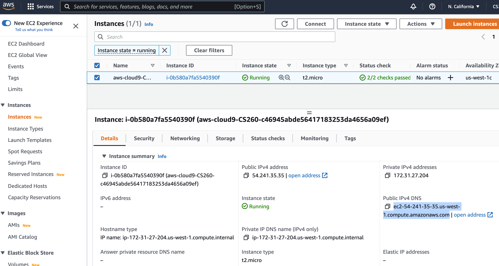

# Setting up HTTPS 

In this tutorial, we will configure Caddy to use https to serve files from your public_html directory.

1. Go back to the EC2 dashboard in AWS Management console. Then select "Instances" and click on your Instance.

Next, find the host name for your EC2 instance -- it is labeled "Public IPv4 DNS".

 

For example, my host name is `ec2-54-186-104-251.us-west-2.compute.amazonaws.com`.

Once you know this host name, you can edit `/etc/caddy/Caddyfile` so that it uses this host name.

2. Edit the file using the nano editor by running the following command from the command line.

```
sudo nano /etc/caddy/Caddyfile
```

You need to replace the ":80" with the host name for your web server.

```

ec2-54-186-104-251.us-west-2.compute.amazonaws.com {
        # Set this path to your site's directory.
        root * /usr/share/caddy
```

3. Exit nano by pressing the "Control" and the "O" key at the same time to save out the file.  Press the "return" key to accept the file name to save to.
Then press the "Control" and the "X" key at the same time to exit the nano eitor.

4. Restart caddy to make caddy use the new configuration file.

```
sudo systemctl restart caddy
```

When caddy sees this new configuration, with a hostname specified, it is now able to automatically request and configure a certificate for your website sot that it can serve files using HTTPS. This provides encryption between the web browser and your web server, so that any information anyone sends to your website, such as a password or a credit card, is encrypted when it is sent to your server.

5. Now you can visit your web server using the `open address` link shown in your EC2 instance, right next to where you found the host name. You should see your "Hello World" web page.

And you should see a lock icon in the browser window. (Note, some browsers are instead showing _nothing_ when the website is secure, and `Not Secure` when it is not secure. So check to see what your browser does for secure sites.)
It may take a while for Caddy to set up a certificate to allow for secure connections, so be patient.


